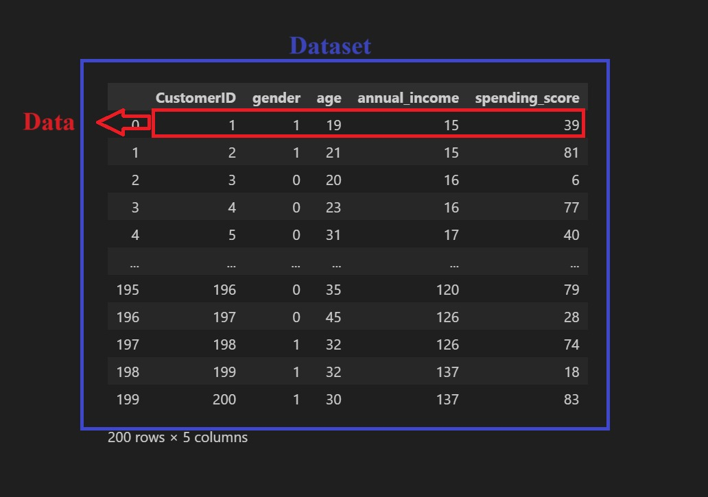
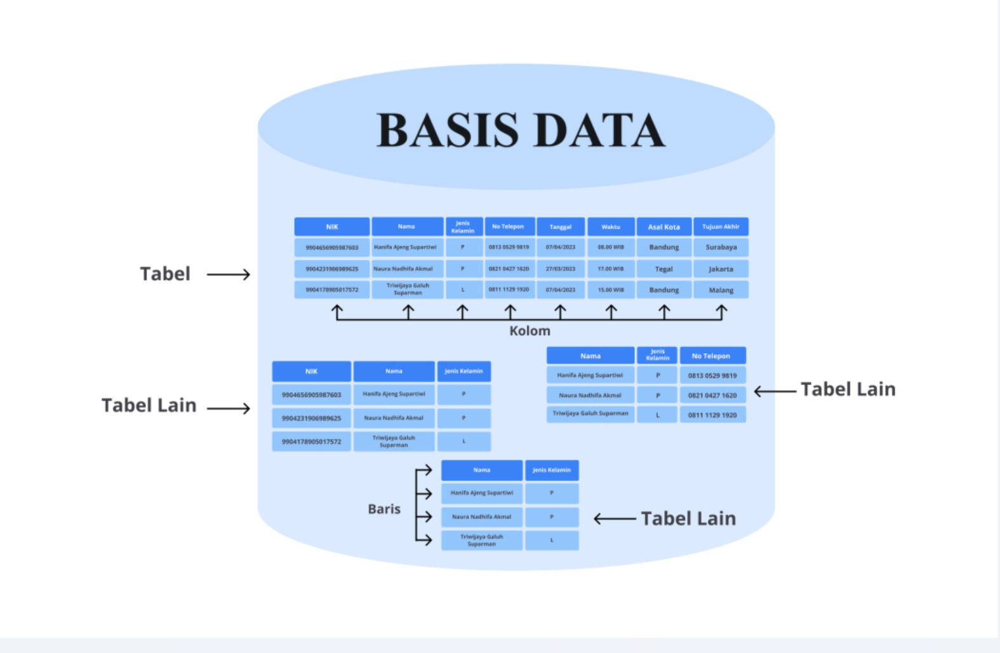
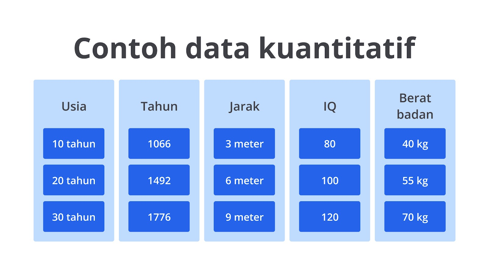
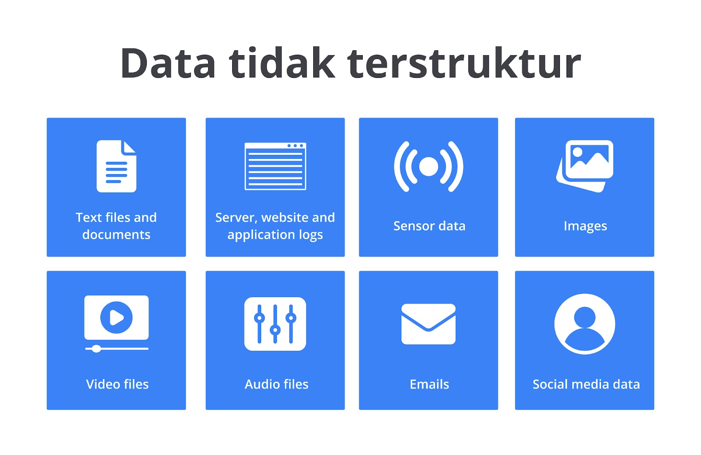

# Data

## Data, Dataset dan Basis Data
Data adalah fakta, nyata dan informasi yang tersimpan di dalamnya dapat berbentuk teks, angka, gambar, suara, dan lainnya.

Dataset merupakan kumpulan informasi yang relevan serta dikumpulkan, disimpan, dan dikelola untuk tujuan tertentu serta disusun secara terstruktur. Data merupakan entri tunggal atau informasi individu yang ada pada dataset.
Dataset dapat digunakan untuk pembangunan ML, analisis statistik, dan visualisasi data.

Basis Data merupakan kumpulan data yang diatur dan disimpan secara terorganisir sehingga dapat diambil dan diakses dengan mudah. Bedanya dengan Dataset adalah Basis Data memiliki banyak kumpulan data dan dapat digunakan untuk aplikasi yang berbeda, sedangkan Dataset merupakan bagian dari data yang diambil dari Basis Data

## Tipe - tipe Data
- Data terstruktur
  - Data Kuantitatif
    - Data Kontinu
    - Data Diskrit
  - Data Kategorikal
    - Data Ordinal
    - Data Nominal
- Data tidak terstruktur

### Data Terstruktur
Jenis data yang memiliki format dan tata letak yang tetap, artinya data ini diatur dalam suatu pola atau struktur yang konsisten sehingga mudah dibaca, diproses, dan dianalisis oleh manusia atau komputer. ex: data kuantitatif dan data kategorikal.

#### Data Kuantitatif
Jenis data yang dapat diukur atau diungkapkan dalam bentuk angka. Biasanya data ini digunakan untuk mengukur atau menggambarkan jumlah, besaran, atau atribut - atribut yang dapat diukur secara numerik.

- Data Kontinu
    : Jenis data yang dapat direpresentasikan dalam berbagai nilai numerik, seperti bilangan decimal, bulat, dan lainnya. Beberapa contoh tipe data kontinu yang umum adalah tinggi, berat, waktu, suhu, usia, dan lainnya.

- Data Diskrit
    : Jenis data numerik yang hanya bisa direpresentasikan dengan bilangan bulat dan tidak dapat dibagi ke dalam unit yang lebih kecil. ex: stock product

#### Data Kategorikal
Jenis data yang mengacu pada bentuk informasi yang dapat disimpan dan diidentifikasi berdasarkan nama atau labelnya. Data kategorikal merupakan data yang dapat dikelompokkan dan terbagi berdasarkan karakteristik atau ciri khasnya masing - masing. ex: Data Ordinal dan Data Nominal.

- Data Ordinal
    : Jenis data yang memiliki urutan atau harus disusun secara berurutan dengan mekanisme peringkat. ex: rating resto

- Data Nominal
    : Jenis data yang tidak memiliki keterkaitan dengan data lainnya dan tidak memiliki arti khusus. Jadi data ini dapat dibedakan tanpa harus mengurutkan atau dibandingkan dengan data lainnya. ex: gender

### Data tidak terstruktur
Jenis data yang tidak memiliki format atau struktur yang jelas. Data ini cenderung bervariasi bentuknya dan sulit untuk diorganisasi dalam kategori atau kolom tertentu. Data tidak terstruktur memiliki sifat lebih bebas, tidak terbatas, dan lebih kompleks dibandingkan dengan data terstruktur.

## Masalah dalam Data
Permasalahan yang biasanya terjadi pada data biasanya disebabkan oleh **kesalahan ketika pengumpulan atau pencatatan data**. Data yang didapat dengan cara yang salah atau bahkan dari sumber yang tidak dapat dipercaya juga bisa disebut sebagai **data sampah**.

Permalasahan umum yang terjadi terdapat pada kualitas data diantaranya, seperti:
- Data yang tidak relevan (*irrelevant*)
- Data yang berbeda dengan yang lain (*outlier*)
- Data duplikat
- Data kosong (*null*)
- Data yang tidak benar, *etc*.

Jika menemui data kosong, kita dapat menanganinya dengan beberapa cara:
- Menghapus data yang kosong
- Mengisi data kosong dengan nilai median/rata-rata jika datanya berupa numerik