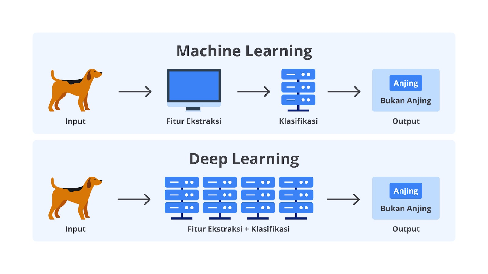
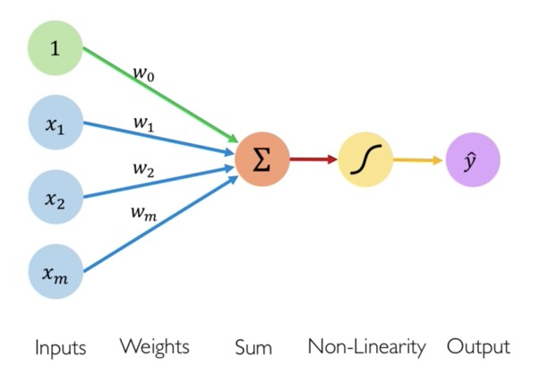
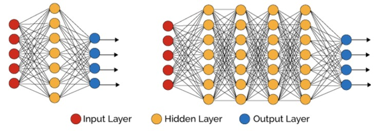

# Deep Learning

Deep learning adalah bagian dari bidang keilmuan AI yang mengajarkan komputer untuk memproses data yang terinspirasi dari cara kerja otak manusia. Model deep learning dapat mengerjakan tugas yang lebih kompleks dari machine learning. Dengan kompleksitas yang cukup tinggi, model deep learning dapat mengenali gambar, teks, suara, dan lainnya.
Deep learning terdiri dari 3 atau lebih lapisan atau bisa disebut *layers*. Ia berperan sebagai pengganti otak manusia sebagai jaringan saraf yang memungkinkan model mempelajari data yang sangat besar.

## Artificial Neural Network

Artificial Neural Network (ANN) atau Jaringan Saraf Tiruan adalah sebuah model machine learning yang terinspirasi dari neuron / saraf yang terdapat pada otak manusia. Neuron / Saraf adalah pembawa pesan / informasi. 

Saraf terdiri dari 3 bagian utama, yaitu akson, dendrit dan badan sel yang di dalamnya terdapat nukleus. 
- Nukleus berisi materi genetik dan bertugas mengontrol seluruh aktivitas sel.
- Akson adalah cabang yang terlihat seperti ekor yang panjang. Ia bertugas untuk mengirim pesan dari sel.
- Dendrit adalah cabang - cabang pendek yang terlihat seperti cabang pohon yang bertugas menerima pesan.

Proses kerja perceptron:
- Input menerima masukan berupa angka-angka
- Setiap input memiliki bobot masing-masing. Bobot adalah parameter yang akan dipelajari oleh sebuah perceptron dan menunjukkan kekuatan node tertentu.
- Selanjutnya tahap penjumlahan input. Pada tahap ini, setiap input akan dikalikan dengan bobotnya masing - masing, lalu hasilnya akan ditambahkan dengan bias yang merupakan sebuah konstanta atau angka. Nila bias memungkinkan untuk mengubah kurva fungsi aktivitas ke atas atau ke bawah sehingga bisa lebih fleksibel dalam meminimalisir error.