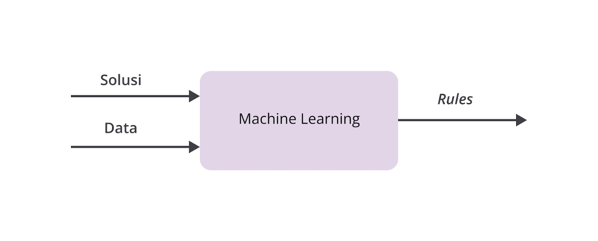
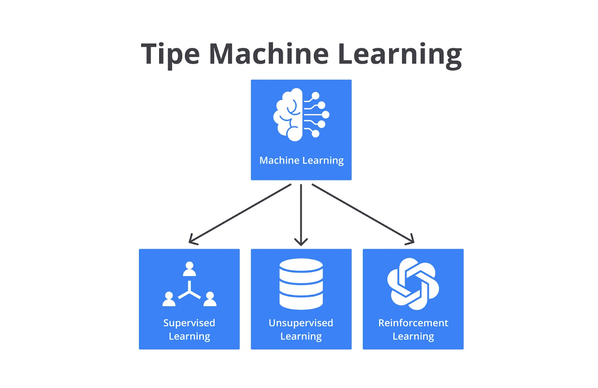

# Machine Learning

Dengan menggunakan Machine Learning, kita tidak perlu lagi mempelajari keseluruhan data dan membuat aturan secara eksplisit. Kita hanya perlu menggunakan algoritma sehingga machine learning dapat menentukan aturannya sendiri.
Algoritma machine learning dapat mencari pola tertentu dari sekumpulan data. Ia menentukan karakteristik data sehingga dapat menyimpulkan sebuah aturan. Selanjutnya aturan ini digunakan untuk mengidentifikasi dan memprediksi data baru yang relevan dengan model machine learning yang dimiliki.

## Tipe - Tipe Machine Learning

