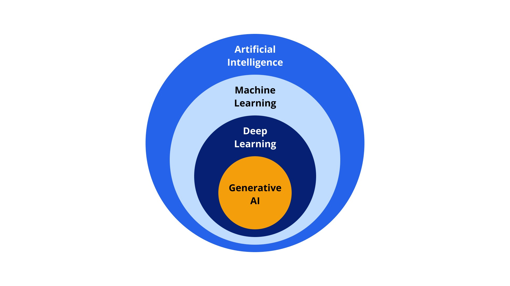
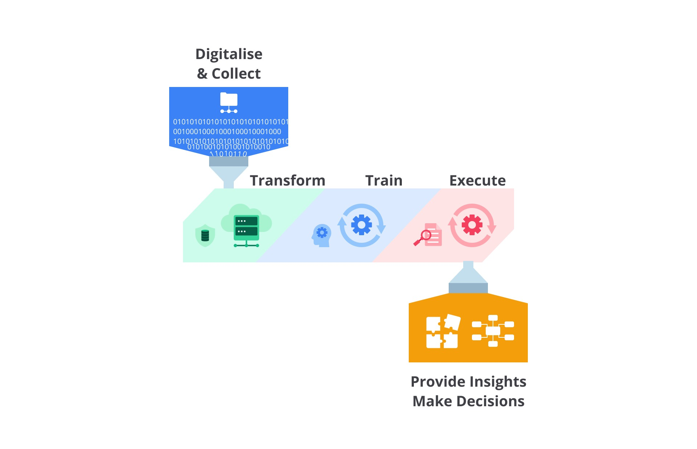

# Getting Started

## Taksonomi AI

### Artificial Intelligence (AI)
AI adalah teknologi yang menerapkan peniruan perilaku manusia terhadap komputer supaya dapat mempelajari dan melakukan tugas tanpa perlu bantuan eksplisit tentang output yang diharapkan.

### Machine Learning (ML)
Machine learning (ML) merupakan salah satu bagian dari AI yang secara otomatis dapat belajar dan berkembang berdasarkan pengalamannya. Machine Learning memanfaatkan metode statistika untuk membuat komputer / machine dapat mempelajari pola pada data tanpa perlu di program secara eksplisit. ML bergantung pada algoritma yang digunakan untuk menganalisa data dalam jumlah besar, belajar dari data dan memberikan decision berdasarkan pengalaman uang dipelajari dengan tepat. Output dari ML sendiri berupa model yang dapat melakukan tugas berdasarkan data pelatihan yang diberikan (makin banyak data makin baik juga model yang dihasilkan). 

### Deep Learning
Deep learning merupakan bagian dari ML. Perbedaan mendasar antara ML dengan Deep Learning adalah pada proses pembelajaran yang didasari oleh saraf tiruan dimana terbagi menjadi beberapa bagian mulai dari input, hidden layer, hingga output. 

### Generative AI
Generative AI merupakan bagian dari Deep Learning. Hasil dari Generative AI sangat beragam, mulai dari bahasa, kode, suara, hingga gambar. Contoh implementasi Generative AI adalah DALL-E. DALL-E sendiri merupakan Generative AI yang dapat menciptakan gambar dari deskriptif tekstual.

## AI Workflow

### Digitalise and Collect
Tahap pengumpulan dan penyimpanan data yang akan digunakan pada proses pembangunan AI.

### Transform
Pada tahap ini semua data yang sudah dikumpulkan akan diproses secara berulang mulai dari persiapan data, mengubah data menjadi format yang dibutuhkan, hingga mengevaluasi data dengan mengidentifikasi data yang tidak dibutuhkan.

### Train
Setelah mendapatkan data yang sudah terorganisir / data yang baik, selanjutnya pada tahap ini akan menentukan algoritma yang cocok untuk pengembangan AI. Tidak ada algoritma yang cocok secara universal untuk data dan tujuan apapun. Oleh karena itu kita harus menentukan algoritma yang cocok dengan data yang kita miliki sehingga menghasilkan AI dengan performa optimial.

### Execute
Selama proses execute, model AI yang sudah dilatih dan disempurnakan akan dievaluasi secara terus - menerus. Proses ini dilakukan untuk memastikan bahwa sistem memenuhi harapan dan memberikan feedback untuk perbaikan.

### Provide Insights Make Decisions
Ketika model AI sudah dapat melakukan tugasnya, sekarang harus melakukan ekstraksi dari pengetahuan yang dimilikinya. Proses ini membantu pengambilan keputusan serta meningkatkan pemahanan kita dalam pengembangan AI selanjutnya.

*Jika ingin membangun AI yang datanya dinamis. Kita perlu memperbarui dataset dan melatih ulang model AI secara reguler. Selain itu juga perlu membuat sistem yang dapat membuat proses update ini berjalan secara otomatis*