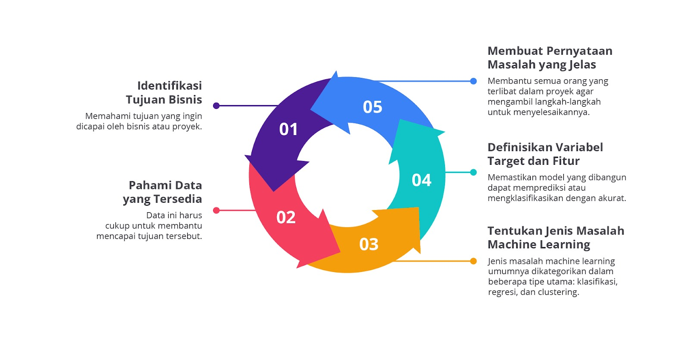
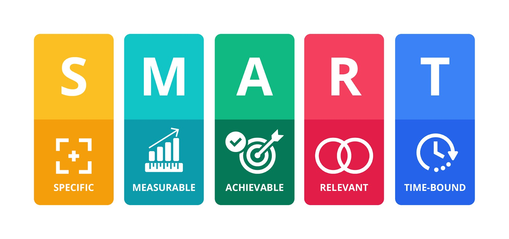
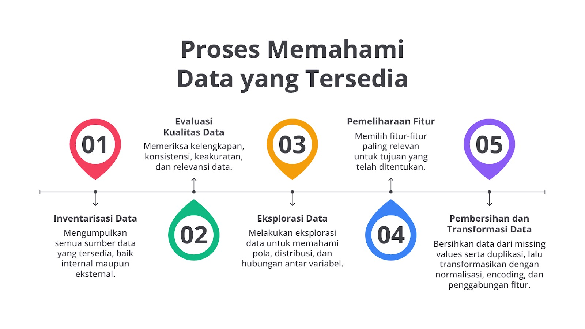
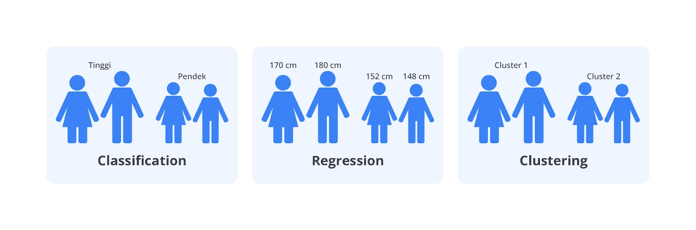
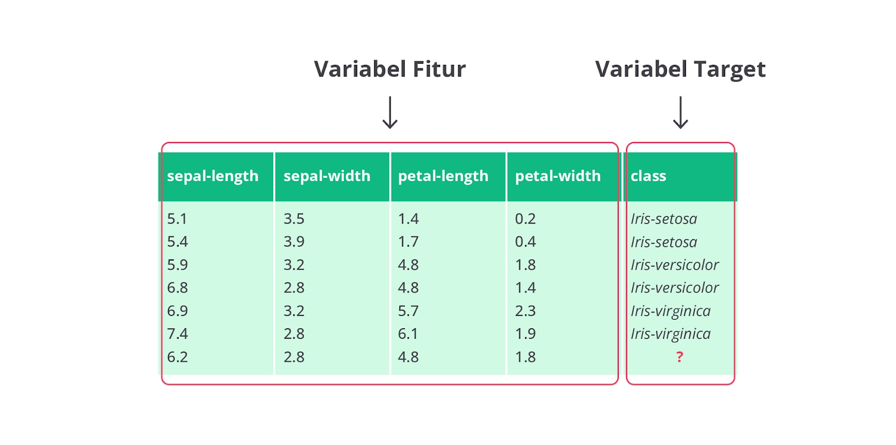
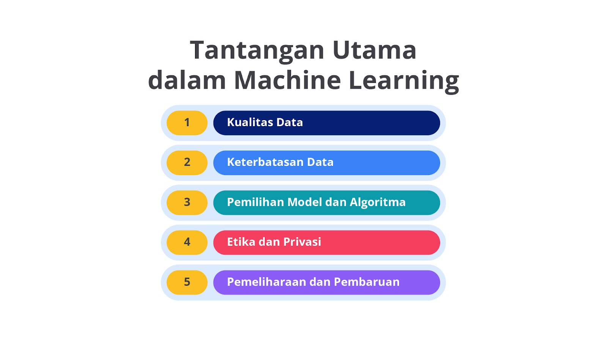

# Machine Learning 

## Pengenalan Machine Learning

*"A field of study that gives computers the ability to learn without being explicitly programmed."*
(Arthur Samuel, 1959)

Machine Learning merupakan cabang ilmu yang memungkinkan komputer belajar dan berkembang tanpa diprogram secara eksplisit untuk setiap tugas. Jadi tanpa di buatkan rules / aturan secara manual oleh manusia, mesin dapat mempelajari pola berdasarkan data. Mesin juga dapat memprediksi atau mengambil decision berdasarkan pembelajaran data tersebut.

## Komponen Utama Machine Learning
Berikut adalah komponen utama dalam machine learning yang penting untuk membangun model yang efektif:
- Dataset (Data)
- Model
- Algoritma Training
- Feature Engineering
- Training
- Evaluation
- Hyperparameter Tuning
- Deployment

### Dataset (Data)
Data merupakan bahan dasar utama untuk machine learning. Tanpa data, model tidak dapat dilatih. Data sendiri terdiri dari feature (attribute) dan label (hasil yang ingin diprediksi).

### Model
Model adalah algoritma matematis yang digunakan untuk mempelajari sebuah pola dari data. Ex: model regresi linier atau decision tree.

### Algoritma Training
Algoritma adalah metode yang digunakan untuk melatih model dengan data. Algoritma menentukan cara model belajar dari data dan mengoptimalkan prosesnya.

### Feature Engineering
Feature engineering adalah proses mengubah data mentah menjadi feature (attribute) yang lebih relevan dan informatif untuk model. Ini termasuk pemilihan dan pembuatan feature baru.

### Training 
Training adalah proses belajar model terhadap data. Model mempengaruhi parameter untuk meminimalisir kesalahan dan meningkatkan akurasi.

### Evaluation
Evaluation adalah proses menilai kinerja model menggunakan data yang digunakan selama pelatihan. Ini melibatkan metrik evaluasi: 
```plaintext
Klasifikasi: 
- Accuracy
- Precission
- Recall
- F1-Score
- ROC-AUC

Regresi:
- RMSE
- MAE
```

### Hyperparameter Tuning
Hyperparameter tuning adalah proses mengoptimalkan parameter di luar model yang berpengaruh pada kinerja model. Ini dilakukan untuk meningkatkan accuracy model. Ex: learning rate, jumlah tree di Random Forest, jumlah layer di neural network, jumlah cluster (K) di K-Means.

### Deployment
Deployment adalah tahap akhir dari model yang telah dilatih

## Jenis - jenis Machine Learning
Berikut adalah beberapa jenis machine learning:
- Supervised Learning
- Unsupervised Learning
- Semi-Supervised Learning
- Reinforcement Learning

### Supervised Learning
Supervised learning menggunakan **data berlabel** untuk melatih model. Tujuannya untuk mempelajari hubungan antara input dan output sehingga model dapat **memprediksi hasil** untuk data baru.

### Unsupervised Learning
Unsupervised learning menggunakan **data tanpa label** untuk mengidentifikasikan pola atau struktur dalam data. Ini termasuk teknik seperti **clustering**, yakni mengelompokkan data berdasarkan feature yang ada.

### Semi-Supervised Learning
Semi-Supervised learning menggabungkan **data berlabel dan tidak berlabel**. Model dilatih dengan data berlabel dan kemudian menggunakan data tidak berlabel untuk meningkatkan accuracy.

### Reinforcement Learning
Reinforcement learning berfokus pada cara agent belajar mengambil tindakan untuk menghasilkan result yang maksimal. Agent belajar melalui percobaan dan kesalahan untuk menemukan tindakan terbaik dalam situasi tertentu.

## Rumusan Masalah dalam Machine Learning

- Identifikasi Tujuan Bisnis
- Pahami Data yang Tersedia
- Tentukan Jenis Masalah Machine Learning
- Definisikan Variable Target dan Feature
- Membuat Pernyataan Masalah yang Jelas

### Identifikasi Tujuan Bisnis
- **Tujuan**: Menetapkan hal yang ingin dicapai (ex: meningkatkan penjualan, mengurangi churn).

- **Methode SMART**: Menetapkan tujuan specific, terukur, dapat dicapai, relevan, dan terikat waktu.

    - **Specific**: tujuan harus jelas dan specific sehingga semua orang yang terlibat memahami hal yang ingin dicapai. 
      - Tujuan yang specific artinya mampu menjawab pertanyaan berikut:
        -  Apa yang ingin dicapai ?
        -  Mengapa tujuan ini penting ?
        -  Siapa yang terlibat ?
        -  Dimana tujuan ini akan dicapai ?

      - Contoh: Meningkatkan tingkat retensi pelanggan PT ABC dengan mengurangi *churn* sebesar 15% dalam 12 bulan ke depan.

    - **Mesurable (Terukur)**: tujuan harus dapat diukur sehingga kita bisa melacak kemajuan dan mengetahui target tujuan tersebut tercapai. Matrik atau indikator kinerja harus ditentukan untuk mengukur kemajuan.
      - Contoh: Menggunakan *matrik churn rate* untuk mengukur jumlah pelanggan yang berhenti berlangganan setiap bulan. targetnya adalah mengurangi *churn rate* dari 20% menjadi 15%

    - **Achievable (Dapat dicapai)**: tujuan harus realistis dan dapat dicapai dengan sumber daya yang tersedia. artinya menetapkan tujuan yang menantang tapi tetap mungkin untuk dicapai.
      - Contoh: Menyediakan pelatihan tambahan untuk tim layanan pelanggan dan meningkatkan dukungan teknis untuk membantu mengurangi *churn*. Mengalokasikan anggaran yang cukup untuk inisiatif ini.

    - **Relevant**: tujuan harus relevan dengan strategi bisnis keseluruhan dan memberikan kontribusi yang signifikan terhadap pencapaian tujuan jangka panjang perusahaan.
      - Contoh: Mengurangi *churn* relevan karena mempertahankan pelanggan lebih murah daripada memperoleh pelanggan baru dan pelanggan yang setia cenderung lebih menguntungkan dalam jangka panjang.

    - **Time-bound (Terikat waktu)**: tujuan harus memiliki batas waktu yang jelas sehingga ada tenggat waktu untuk bekerja menuju pencapaian tujuan tersebut. Batas waktu membantu menjaga fokus dan rasa urgency.
      - Contoh: Mengurangi *churn* sebesar 15% dalam 12 bulan ke depan dengan evaluasi bulanan untuk memantau kemajuan dan menyesuaikan strategi jika diperlukan.

### Pahami Data yang Tersedia

- **Inventarisasi Data**: mengidentifikasi semua sumber data internal dan eksternal.

- **Evaluasi Kualitas Data**: memeriksa kelengkapan, konsistensi, keakuratan, dan relevansi data.
    - Contoh: 
      - Kelengkapan: **mengisi missing value dengan mean, median, atau metode lain**.
      - Konsistensi: memastikan semua entri tanggal menggunakan format yang sama (ex: format tanggal YYYY-MM-DD)
      - Keakuratan: **menghapus atau memperbaiki** data yang tidak masuk akal.(ex: usia pelanggan bernilai negatif)
      - Relevansi: memastikan feature yang digunakan relevan dengan tujuan prediksi

- **Eksplorasi Data**: mengunakan visualisasi serta analisa statistik untuk memahami pola dan hubungan antar variable.
    - Contoh:
      - **Histogram**: untuk melihat distribusi usia pelanggan
      - **Scatter Plot**: untuk memahami hubungan antara pendapatan dan pengeluaran
      - **Matriks Kolerasi**: untuk melihat kolerasi antara berbagai feature (ex: pendapatan dengan frekuensi belanja)

- **Pemilihan Feature**: memilih feature yang relevan untuk model.
    - Contoh:
      - Feature Relevan: jumlah transaksi bulanan, total pengeluaran tahunan, frekuensi interaksi dengan layanan pelanggan untuk memprediksi *churn*
      - Feature Tidak Relevan: nomor telepon atau alamat email yang tidak mempengaruhi prediksi *churn*

- **Pembersihan dan Transformasi Data**: mengatasi masalah seperti *missing values, duplikasi, dan transformasi data*.
    - Contoh:
      - **Missing Values**: mengisi nilai hilang pada kolom pendapatan dengan median pendapatan dari seluruh data.
      - **Duplikasi**: menghapus entri duplikat pada riwayat transaksi pelanggan.
      - **Standarisasi Format**: menstandarkan format tanggal pada semua data transaksi.
      - **Normalisasi**: skala variable jumlah transaksi.
      - **Encoding**: gunakan one-hot encoding untuk variable kategorikal.
      - **Penggabungan Feature**: gabungan total pengeluaran bulanan dan tahunan

### Tentukan Jenis Masalah Machine Learning

- **Klasifikasi**: mengelompokkan data ke dalam category yang sudah ditentukan(ex: menentukan apakah pelanggan akan *churn*)
    - Algoritma:
      - K-Nearest Neighbors (KNN)
      - Decision Trees
      - Random Forests
      - Support Vector Machines (SVM)
      - Logistic Regression
    - Kriteria Evaluasi:
      - Akurasi
      - Precision 
      - Recall
      - F1-Score
      - ROC-AUC Score

- **Regresi**: memprediksi nilai numerik kontinu (ex: tinggi badan)
  - ALgoritma:
    - Linear Regression
    - Polynomial Regression
    - Support Vector Regression (SVR)
    - Random Forest Regression
    - Gradient Boosting Regressor
  - Kriteria Evaluasi:
    - Mean Squared Error (MSE)
    - Mean Absolute Error (MAE)
    - R-squared(R2) Score

- **Clustering**: mengelompokkan data berdasarkan kesamaan karakteristik tanpa label (ex: segmentasi pelanggan)
  - Algoritma:
    - K-Means Clustering
    - Hierarchical Clustering
    - DBSCAN (Density-Based Spatial Clustering of Applications with Noise)
    - Gaussian Mixture Models
  - Kriteria Evaluasi:
    - Silhouette Score
    - Davies-Bouldin Index
    - Inertia (untuk K-Means)

### Definisikan Variable Target dan Feature

- **Feature**: variable yang digunakan untuk mendeskripsikan data (ex: panjang dan lebar sepal bunga iris)

- **Target**: variable yang ingin diprediksi atau diklasifikasikan (ex: species bunga iris)

### Membuat Pernyataan Masalah yang Jelas
- Rumusan masalah dengan pernyataan yang specific untuk mengarahkan development model (ex: "memprediksi apakah pelanggan akan *churn* dalam 3 bulan ke depan")

## Kendala dalam Machine Learning

- **Kualitas Data**: data harus bersih dan bebas dari error karena data yang buruk dapat mempengaruhi accuracy model.

- **Keterbatasan Data**: terlalu sedikit data atau ketidakseimbangan category dapat mempengaruhi efectivitas model.

- **Pemilihan Model dan Algoritma**: memilih model dan algoritma yang tepat serta mengatur hyperparameter dengan benar. (ex: model regresi digunakan untuk prediksi nilai kontinu, sedangkan model klasifikasi dimanfaatkan dalam menentukan category)

- **Etika dan Privasi**: melindungi data pribadi dan menghindari bias dalam data.

- **Pemeliharaan dan Pembaruan**: model perlu diperbarui secara berkala agar tetap relevan dengan data baru.
