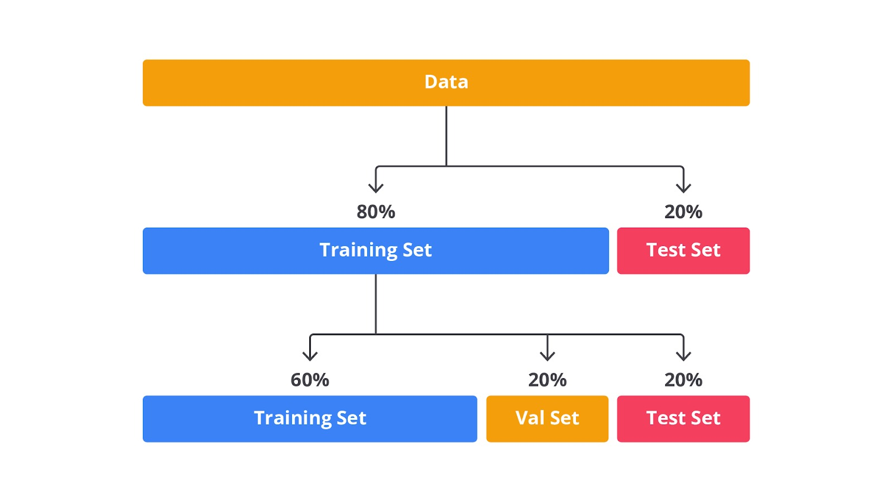
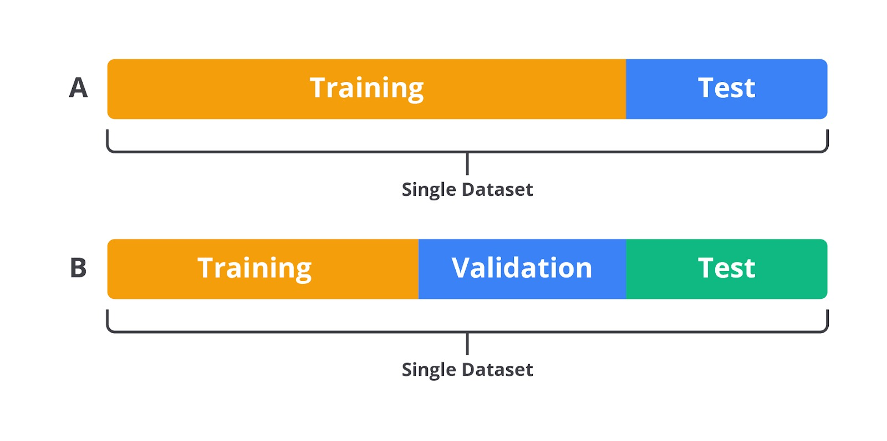

# Data Processing

## Data Splitting

Data splitting adalah proses membagi dataset menjadi beberapa subset yang terpisah untuk tujuan pelatihan, validasi, dan pengujian model machine learning. Proses ini merupakan langkah penting dalam pipeline machine learning yang baik tidak hanya pada data pelatihan, tetapi juga pada data baru yang belum pernah dilihat sebelumnya.

## Peran Data Splitting:

- Menghindari overfitting
    : Tanpa data splitting, model machine learning mungkin belajar terlalu banyak dari data pelatihan, termasuk noise dan outliers, sehingga kinerjanya akan menurun pada data baru. Data splitting membantu menguji generalisasi model pada data yang belum pernah dilihat oleh model pada proses pelatihan.

- Menyediakan evaluasi yang akurat
    : Dengan memisahkan data untuk pelatihan, validasi, dan pengujian maka bisa mengevaluasi model secara akurat. Proses ini dapat membantu dalam memilih model terbaik dan mengatur hyperparameter dengan lebih baik.

- Memberikan validasi yang adil
    : Data splitting memungkinkan untuk melakukan validasi model secara adil dengan menggunakan bagian dari data yang dilibatkan dalam proses pelatihan untuk mengukur kinerja model.

## Proses Splitting Data

Secara garis besar proses splitting data terbagi menjadi 2 yaitu:
- Training dan Testing
- Training, Testing, dan Validation

**Training Set**
- Subset data yang digunakan untuk melatih model. Model belajar pola dari data ini dan menyesuaikan parameternya.
- Persentase Umum: 60-80% dari total dataset

**Validation Set**
- Subset data yang digunakan untuk melakukan validasi selama proses pelatihan, data ini digunakan untuk tuning hyperparameter dan memilih model terbaik. Model tidak melihat data ini selama pelatihan.
- Persentase Umum: 10-20% dari total dataset

**Test Set**
- Subset data yang digunakan untuk melakukan pengujian akhir setelah model selesai dilatih dan di-tuning, data ini memberikan estimasi kinerja model pada data baru.
- Persentase Umum: 10-20% dari total dataset

## Teknik Data Splitting

**Holdout Method**
    : Teknik sederhana yang membagi dataset menjadi 2 (training set dan test set) atau 3 (taining set, test set, dan validation set) bagian.
    - Plus: Mudah diimplementasikan dan cepat
    - Minus: Jika dataset kecil, pembagian data mungkin tidak mewakili distribusi data secara keseluruhan

**K-Fold Cross Validation**
    : Teknik yang membagi dataset menjadi k subset (folds). Model dilatih *"k"* kali setiap menggunakan satu fold sebagai test set dan k-1 fold lainnya sebagai training set.
    - Plus: Memberikan evaluasi yang robust, mengurangi bias karena setiap data digunakan untuk pelatihan dan pengujian
    - Minus: Lebih lambat karena model harus dilatih *"k"* kali

**Stratified Splitting**
    : Teknik yang membagi dataset sedemikian rupa sehingga proporsi kelas dalam training, test, dan validation set tetap sama seperti dataset asli. Ini sangat penting jika kondisi dataset tidak seimbang.
    - Plus: Menghindari bias dalam prediksi pada kelas minoritas
    - Minus: Lebih kompleks daripada holdout biasa

**Time Series Splitting**
    : Teknik yang membagi dataset time series berdasarkan waktu. Data yang lebih baru digunakan untuk pengujian, sementara data yang lebih lama digunakan untuk pelatihan.
    - Plus: Cocok untuk data time series yang membutuhkan urutan kronologis
    - Minus: Tidak dapat digunakan untuk data non-time series

## Optimalisasi Data Splitting

Beberapa hal penting untuk dipertimbangkan dalam melakukan splitting data secara optimal:
- **Imbalance Data**
    : Jika dataset memiliki distribusi kelas yang tidak seimbang, maka teknik seperti stratified splitting sangat penting untuk memastikan bahwa model tidak bias terhadap kelas mayoritas.

- **Data Leakage**
    : Data leakage terjadi ketika informasi dari luar set pelatihan *bocor* ke dalam proses pelatihan sehingga kinerja model di test set tampak lebih baik daripada yang sebenarnya. Splitting yang benar membantu menghindari masalah ini.

- **Randomness**
    : Randomness dalam proses splitting penting untuk memastikan bahwa pembagian data tidak bias. Namun, untuk eksperimen yang dapat direproduksi, sangat penting untuk menetapkan random_state yang tetap.

## Prepocessing Data

Ada beberapa jenis prepocessing yang sebaiknya dilakukan sebelum data splitting, terutama jika prepocessing tersebut memerlukan pengetahuan tentang keseluruhan dataset seperti berikut:

- **Imputasi Missing Values**
    : Jika memiliki missing values dalam dataset, sebaiknya diisi dengan menggunakan median sebelum melakukan splitting. Ini karena proses pengisian missing values memerlukan keseluruhan distribusi data, bukan hanya pada subset data tertentu.
- **Encoding Kategorikal**
    : Proses encoding pada variable kategorikal sebaiknya dilakukan sebelum splitting untuk memastikan bahwa encoding konsisten di semua dataset.
- **Pembersihan Data Umum**
    : Pembersihan data yang melibatkan penghapusan outliers, menangani duplikasi, atau menyamakan format data juga sebaiknya dilakukan sebelum splitting data. Proses ini akan memastikan bahwa data yang masuk ke proses splitting sudah dalam kondisi terbaiknya.

Beberapa preprocessing yang sebaiknya dilakukan seteleah data splitting (untuk menhindari data leakage / bocornya informasi dari test set ke dalam model pelatihan):

- **Standarisaasi/Normalisasi**
    : Proses standarisasi (mengubah data agar memiliki mean 0 dan standar deviasi 1) atau normalisasi (mengubah data agar berbeda dalam rentang tertentu) sebaiknya dilakukan setelah splitting. Ini karena untuk memastikan bahwa test set benar - benar terpisah dari data pelatihan, dan standarisasi atau normalisasi dilakukan hanya berdasarkan data pelatihan.

- **Feature Engineering**
    : Teknik seperti pembuatan feature baru atau transformasi feature (misalnya log, transform, polynomial features) sebaiknya dilakukan setelah data splitting untuk menghindari informasi dari test set yang mempengaruhi model.

- **Scaling dan Principal Component Analysis (PCA)**
    : Teknik seperti scaling atau PCA yang mengubah skala atau struktur data juga sebaiknya dilakukan setelah proses data splitting.