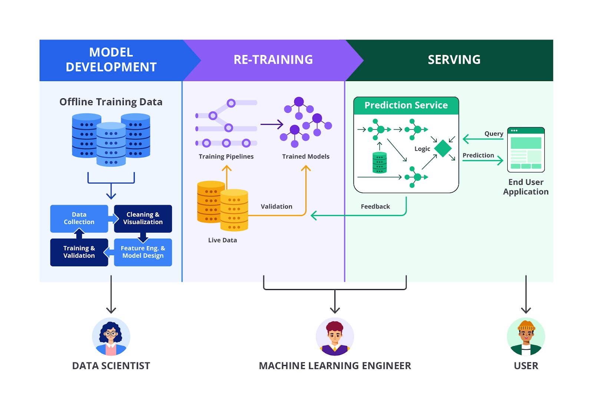

# Deployment dan Monitoring

Deployment adalah proses pelatihan model dengan mengintegrasikannya ke dalam aplikasi atau system produksi, sehingga dapat digunakan oleh end user.

Monitoring adalah proses untuk memastikan bahwa model bekerja dengan baik setelah deployment dan untuk mengidentifikasi jika ada degradasi kinerja atau masalah lain.

Model machine learning dapat mengalami penurunan kinerja dari waktu ke waktu karena perubahan dalam data yang masuk (concept drift) atau perubahan dalam distrubusi data (data drift). Selain itu monitoring membantu mendeteksi anomali atau bugs yang mungkin muncul saat model digunakan di dunia nyata. Dan yang paling penting monitoring juga berperan untuk memastikan bahwa model mematuhi regulasi atau kebijakan internal terkait privasi, keamanan, atau fairness.

## Metriks yang Dimonitor
- **Accuracy, Precission, Recall, F1-Score**: digunakan untuk evaluasi model klasifikasi.
- **Mean Squared Error(MSE), R-Squared**: digunakan untuk evaluasi model regresi
- **Data Drift Metrics**: memantau perubahan distribusi data input dibandingkan dengan data yang digunakan saat pelatihan.
- **Model Latency**: mengukur waktu yang diperlukan model untuk memberikan prediksi. Hal ini penting untuk apps real-time.

## Alat Monitoring
- **Prometheus/Grafana**: digunakan untuk memantau metrics dan membuat custom dashboard
- **ELK Stack(Elasticsearch, Logstash, Kibana)**: digunakan untuk memonitoring log dan menganalisis anomali
- **Sentry**: digunakan untuk mendeteksi dan melaporkan error di applikasi yang mengintegrasikan model
- **MLFlow**: tools khusus untuk tracing eksperimen dan monitoring model machine learning
