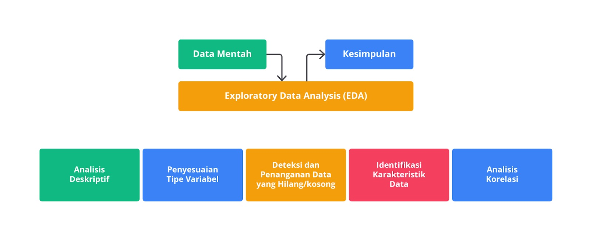

# Exploratory dan Explanatory Data Analysis

## Tujuan EDA vs ExDA

- **Exploratory Data Analysis (EDA)**: untuk memahami struktur, karakteristik, dan pola dalam data. Fokus menemukan insight atau informasi yang tersembunyi dalam data, mengidentifikasi anomali, serta memahami hubungan antar variable. Biasanya bersifat eksploratif dan terbuka jadi tahap ini akan lebih digunakan untuk memahami data secara mendalam dan membangun hipotesis.

- **Explanatory Data Analysis (ExDA)**: untuk mengkomunikasikan temuan atau insight yang sudah didapatkan kepada audiens luas. Fokus pada penyampaian informasi yang jelas, ringkas, dan meyakinkan, dengan dukungan visualisasi yang efektif dan narasi yang kuat.

## Pendekatan dan Metodologi
- **Exploratory Data Analysis (EDA)**: 
  - EDA sering menggunakan berbagai teknik statistik deskriptif seperti mean, median, standar deviasi, dan distribusi frekuensi, serta visualisasi data seperti histogram, scatter plot, box plot, dan heatmap untuk mengekplorasi data.
  - Metodologi dalam EDA bersifat iteratif dan fleksibel. Seorang analis dapat mencoba berbagai pendekatan, mengubah parameter, atau menggunakan berbagai visualisasi hingga mendapatkan insight yang mendalam.
  - EDA sering kali melibatkan proses cleanning data sehingga data yang hilang, outlier, atau inkonsistensi diidentifikasi dan diperbaiki.

- **Explanatory Data Analysis (ExDA)**:
  - ExDA menggunakan visualisasi dan narasi yang sangat berfokus dan terarah sehingga setiap elemen dalam presentasi atau laporan ditujukan untuk mendukung argumen atau kesimpulan yang ingin disampaikan.
  - Metodologi dalam ExDA bersifat terstruktur dan sistematis, biasanya dimulai dari pernyataan masalah atau hipotesis, kemudian mendukungnya dengan data yang telah dieksplorasi dan dianalisis, dan diakhiri dengan kesimpulan yang jelas.
  - ExDA sering menggunakan storytelling sebagai alat untuk menyampaikan temuan, memastikan bahwa audiens dapat memahami dan terhubung dengan informasi yang disampaikan.

## Visualisasi Data

- **Exploratory Data Analysis (EDA)**:
  - Visualisasi data dalam EDA bersifat eksploratif dan sering digunakan untuk membantu analis memahami data. Visualisasi dapat berupa berbagai jenis grafik yang menunjukkan hubungan antar variable, distribusi data, atau pola yang tidak terduga.
  - Visualisasi data EDA tidak selalu rapi atau terstruktur, melainkan lebih banyak digunakan untuk mendukung pemahaman dan penggalian insight.

- **Explanatory Data Analysis (ExDA)**:
  - Visualisasi data dalam ExDA dirancang untuk menghasilkan komunikasi yang efektif. Grafik dan visual yang digunakan dalam ExDA harus jelas, sederhana, dan langsung ke point utama yang ingin disampaikan.
  - Contoh visualisasi data yang sering digunakan dalam ExDA yaitu bar chart, line chart, atau pie chart yang sederhana, tetapi efektif serta infografis yang dapat menyampaikan informasi dengan cara yang menarik dan mudah dipahami.

## Audiens

- **Exploratory Data Analysis (EDA)**:
  - Analis Data, Data Science, Researcher yang bekerja langsung dengan data untuk memahami dan mengembangkan hipotesis.
  - EDA adalah proses internal, sering kali dilakukan oleh individu atau tim yang bertanggung jawab atas pengolahan dan analisis data.

- **Explanatory Data Analysis (ExDA)**:
  - Stakeholder, Pengambik Keputusan, Manajer atau Client yang memerlukan informasi untuk membuat keputusan bisnis atau memahami hasil dari analisis yang dilakukan.
  - ExDA adalah proses eksternal yang berfokus pada komunikasi dan presentasi hasil analisis kepada pihak yang mungkin tidak memiliki latar belakang teknis yang mendalam.

## Contoh Kasus

- **Exploratory Data Analysis (EDA)**:
  - Misal dalam sebuah proyek penelitian yang bertujuan untuk menemukan faktor - faktor yang mempengaruhi penjualan produk, EDA akan digunakan untuk memahami berbagai variable seperti harga, lokasi, waktu promosi, dan lainnya berhubungan dengan penjualan.Pada tahap ini, analis bisa menemukan pola - pola tak terduga atau anomali dalam data.

- **Explanatory Data Analysis (ExDA)**:
  - Setelah temuan signifikan diperoleh dari EDA, ExDA akan digunakan untuk menyusun laporan yang menjelaskan faktor - faktor yang mempengaruhi penjualan kepada manajemen, dengan menggunakan grafik sederhana, tabel, dan narasi yang jelas sehhingga manajemen dapat membuat keputusan yang tepat berdasarkan hasil analisis.

## Output

- **EDA**: Hasil dari EDA biasanya insight, hipotesis baru, pemahaman yang lebih dalam tentang data, dan beberapa rekomendasi awal untuk analisis lebih lanjut.

- **ExDA**: Hasil dari ExDA biasanya berupa laporan akhir, presentasi, atau dashboard yang berfungsi untuk menyampaikan hasil analisis dengan cara yang informatif dan mudah dipahami oleh audiens non-teknis.

