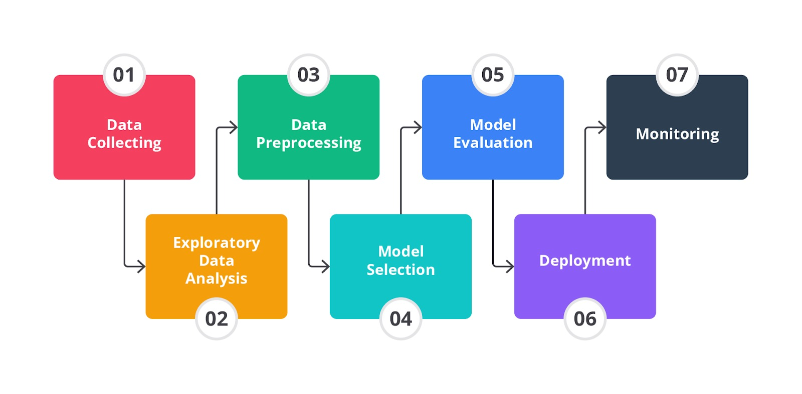

# Pengenalan Machine Learning Workflow
Berikut workflow machine learning:

- **Data Collecting**: pengumpulan data dari sumber internal maupun eksternal (ex: database, file, data sensor, dan sumber lainnya).'

- **Exploratory Data Analysis (EDA)**: bertujuan sebagai analisis awal terhadap data dan melihat bagaimana kualitas data untuk meminimalisir potensi error di kemudian hari. (ex: investigasi awal pada data untuk memahami data, menemukan pola, anomali, menguji hipotesis, memahami distribusi, frekuensi, hubungan antara variable, dan memeriksa asumsi dengan teknik statistik dan representasi grafik).

- **Data Preprocessing**: untuk mempersiapkan data mentah agar dapat digunakan secara efektif oleh model machine learning.

- **Model Selection**: melibatkan pemilihan algoritma terbaik untuk memecahkan masalah specific berdasarkan data yang tersedia.

- **Model Evaluation**: evaluasi model menggunakan data uji (ex: memprediksi label pada data uji, menghitung jumlah prediksi yang error kemudian membandingkan dengan data label yang dimiliki, dari perbandingan ini akan didapat accuracy atau performa model).

- **Deployment & Monitoring**: model yang telah success dilatih dan diuji diterapkan ke env production sehingga dapat digunakan oleh end user atau sistem untuk membuat prediksi pada data baru.