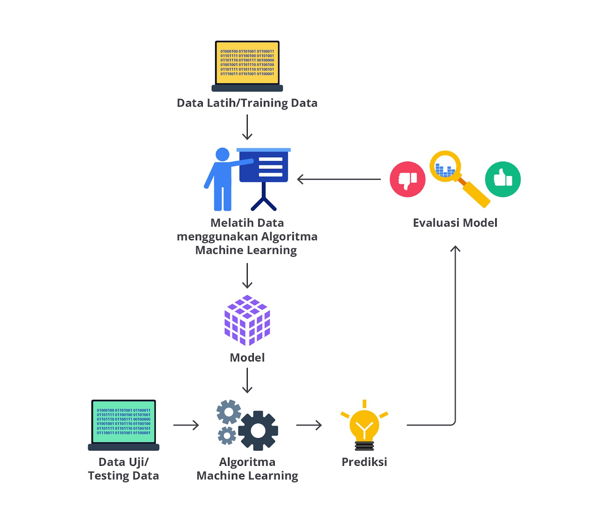
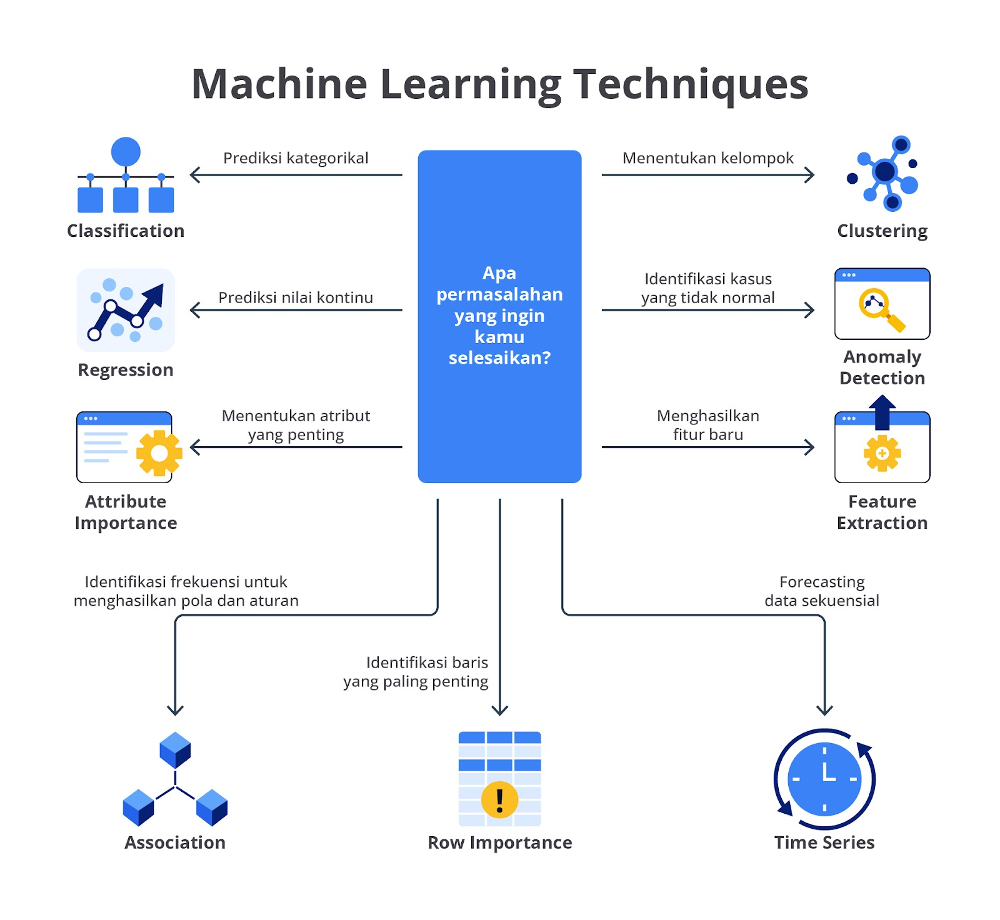

# Pembagunan Model (Modelling)



Data modelling adalah proses memilih, melatih, dan mengevaluasi model machine learning untuk memprediksi atau mengklasifikasikan data berdasarkan feature atau variable yang tersedia.

Proses pembangunan model memiliki beberapa tahapan:
- Memilih model yang tepat
- Melatih model (Training)
- Evaluasi model
- Hyperparameter tuning
- Pengujian hinga interpretasi model

## Memilih Model yang Tepat



- Regresi: jika target yang ingin diprediksi adalah data kontinu (ex: harga rumah), model regresi seperti Linear Regression, Ridge Regression, atau Random Forest Regressor datap digunakan untuk menyelesaikan permasalahan tersebut.

- Klasifikasi: jika target adalah variable kategoro (ex: apakah email adalah spam atau bukan), model klasifikasi seperti Logistic Regression, Decision Trees, Random Forest, atau Support Vector Machines (SVM) mungkin lebih sesuai.

- Clustering: untuk mengelompokkan data ke dalam beberapa kategori atau cluster tanpa label yang jelas. (ex: K-Means, DBSCAN)

## Melatih Model (Training)
Pada tahap training ini model akan belajar dari training set dengan menyesuaikan parameternya agar dapat memetakan input (feature) dan output (target) dengan baik. Selama pelatihan, model akan menyesuaikan bobot atau koefisiennya untuk meminimalkan kesalahan antara prediksi dan nilai sebenarnya dalam training set.
- Feature adalah data input yang digunakan untuk melatih model
- Target adalah data output yang menjadi referensi model untuk belajar

## Evaluasi Model
Pada tahap evaluasi ini model akan di test menggunakan validation set untuk melihat seberapa baik model mampu memprediksi output yang benar dari input yang belum pernah dilihat sebelumnya.

Metrik umum untuk evaluasi adalah *accuracy, precision, recall, F1-score(untuk klasifikasi)*, *Mean Absolute Error(MAE), Mean Squared Error(MSE) atau R-squared(untuk regresi)* dan *Silhoutte Score dan Within-Cluster Sum of Squares(WCSS)(untuk clustering)*.

### Evaluasi untuk model klasifikasi
- Klasifikasi digunakan saat hasilnya kategori (misal: ya/tidak, A/B/C).
- Tujuannya: seberapa banyak prediksi model benar dibanding data aslinya.

Gunakan metrik berikut:
1. **Accuracy** → seberapa banyak prediksi yang benar dari total data. rekomendasi kalau data seimbang antara tiap kelas.
2. **Precision** → dari semua yang diprediksi positif, berapa yang benar-benar positif. Cocok kalau ka greatly ingin menghindari terlalu banyak false positive (contoh: deteksi spam).
3. **Recall** → dari semua yang benar-benar positif, berapa yang berhasil ditemukan model. biasanya kasus penting contoh: deteksi penyakit.
4. **F1-score** → kombinasi precision dan recall, digunakan kalau datanya tidak seimbang.
5. **ROC-AUC** → seberapa baik model membedakan antar kelas, sering dipakai untuk perbandingan antar model klasifikasi.
**Kesimpulan:**
Klasifikasi → pakai Accuracy, F1, Precision, Recall, atau ROC-AUC tergantung tujuan.

### Evaluasi untuk regresi
- Regresi digunakan kalau hasilnya angka (misal: harga, berat, nilai).
- Tujuannya: seberapa dekat hasil prediksi dengan nilai aslinya.

Gunakan metrik berikut:
1. **MAE (Mean Absolute Error)** → rata-rata selisih absolut antara prediksi dan nilai asli. Mudah dipahami karena hasilnya dalam satuan yang sama dengan target.
2. **MSE (Mean Squared Error)** → rata-rata selisih kuadrat error. Memberi penalti besar untuk kesalahan besar.
3. **RMSE (Root Mean Squared Error)** → akar dari MSE. Mirip MAE tapi lebih sensitif terhadap error besar.
4. **R² (R-squared)** → seberapa besar variasi data bisa dijelaskan oleh model (semakin mendekati 1, semakin bagus).
**Kesimpulan:**
Regresi → pakai MAE, MSE, RMSE, dan R² tergantung kebutuhan.
Jika ingin tahu error rata-rata real → MAE.
Jika ingin tahu seberapa bagus model menjelaskan data → R².

### Evaluasi untuk clustering
- Clustering digunakan kalau tidak ada label dan ka greatly ingin mengetahui pola kelompok dalam data.
- Tujuannya: seberapa baik data yang mirip dikelompokkan bersama.

Gunakan metrik berikut:
1. **Silhouette Score** → mengukur seberapa mirip data dalam cluster-nya sendiri dibanding cluster lain. Semakin tinggi semakin bagus.
2. **Davies-Bouldin Index** → semakin rendah nilainya, semakin baik cluster-nya.
**Kesimpulan:**
Clustering → nilai Silhouette tinggi, atau DB Index rendah artinya model bagus.

## Menyimpan Model
- Joblib: pilihan yang disarankan untuk menyimpan model scikit-learn karena lebih efisien dalam menyimpan object model yang besar
```python
import joblib
 
# Menyimpan model ke dalam file
joblib.dump(GBR, 'gbr_model.joblib')
```

- Pickle: modul standar python yang digunakan untuk menyimpan hampir semua object python termasuk model machine learning
```python
import pickle
 
# Menyimpan model ke dalam file
with open('gbr_model.pkl', 'wb') as file:
    pickle.dump(GBR, file)
```